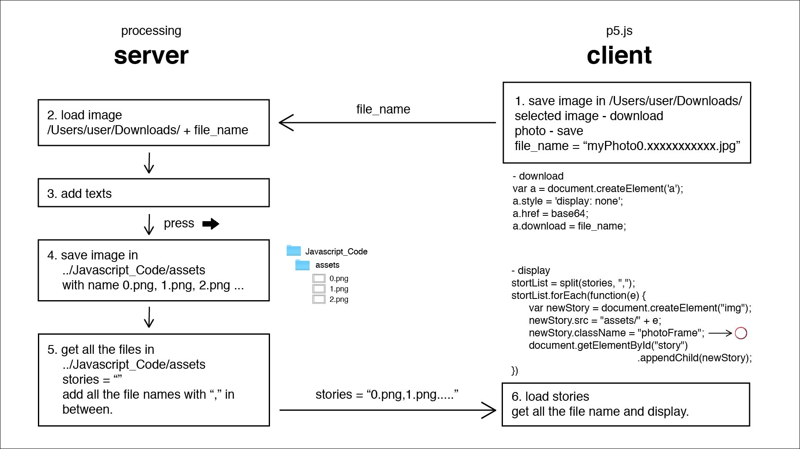

# STORYBOOTH #

## Author

* **Name**: Sewon Lim
* **Student ID**: 20170536
* **email**: sewon0918@kaist.ac.kr

---

## Table of content

* [Java code](Java_Code/) for server side
* [Javascript code](Javascript_Code/) for client side
* [Video](Video/) for demo
* README.md (this file) for description of project. 

## Description

This project STORYBOOTH is a simple photo editor using text. I was inspired by the story function of instagram. I realized that we can only post stories in mobile, not in desktop. So I wanted to make desktop application that has similar function to story function in Instagram.
The name STORYBOOTH is combination of STORY + BOOTH of photobooth.

## How it works

1. Client side

(1) camera button
You can take a picture by pressing camera button. If you want to take it again, press camera button once more. If you click the right side of the canvas, the screen become grid form which shows multiple video. Every time you press, the number of grid increases, and every time you press the left side of the canvas, the number of the grid decreases.

(2) gray filter
You can make your camera become grayscale by clicking gray filter. Press it once more to go back to normal filter.

(3) gallery button
If you want to select image from your computer rather than taking picture, press gallery button. If you select an image, the image will be loaded. Press X button on the left right of you want to select again. 

(4) upload button
When you're done with taking picture of selecting image, press upload button then your image will be loaded on the server side. 

2. Server side 

(1) text button
You can add new text by pressing text button. If you press it, a black cursor appears in the center of the image. You can press ENTER to finish writing a text, which means removing cursor. 
You can add multiple texts, and when you add a new text, all the previous texts that is not finished are automatically finish. If you want to modify the text you already finished, you can just double click the text, then the black cursor will come out again. 

(2) font button and color button
If you click font button, 20 types of fonts appears and you can choose the font you want. 
You can also change color of the text by clicking color button and adjusting R G B values by slider.

(3) size slider and rotation slider
You can change size and rotation by dragging small black ball of each slider. 

---
Since you can add multiple texts, you have to make sure which text you will work on among texts you have written when you are doing (2) or (3). You can do this by clicking the text.

---

(4) delete button
You can delete certain text by dragging to the delete button and releasing, 

(5) upload button
When you're done with your work, press upload button then you can see it on the client side. 

3. Client side again

The first picture is when the stories are first loaded. The border color is pink. 
The second picture is when you click a story, which shows that story big. You can hide big image by clicking again.
The last picture is after clicking a story. the border color became gray. 

## Overall Structure

This is the diagram of how the client side and the server side communicate.

This is the UML of my Java code.

## Source of inspiration

- flipping video horizontally
https://forum.processing.org/two/discussion/22546/how-do-i-flip-video-in-canvas-horizontally-in-p5js
- changing input file design
https://cccat.tistory.com/14
- hiding, shoieng button with javascript
https://m.blog.naver.com/PostView.nhn?blogId=necall&logNo=220798417117&proxyReferer=https:%2F%2Fwww.google.com%2F
- dealing with favicon 404 error
https://doolyit.tistory.com/153

